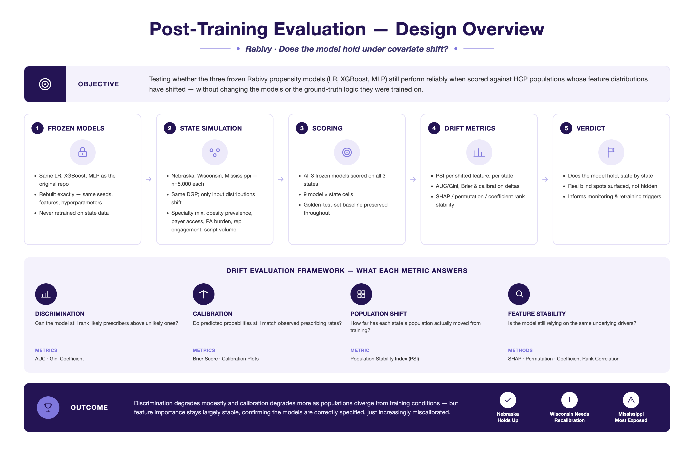

# Rabivy: AI-ML Post-Training Evals

 

**Disclaimer**: 

Rabivy and AX Pharmaceuticals are fictional and were created solely for the purposes of this demonstration and portfolio project. This project is an independent demonstration and was not commissioned by any pharmaceutical company. 

---

### Introduction 

The original project built and evaluated three models — Logistic Regression, XGBoost, and an MLP — predicting HCP propensity to prescribe Rabivy, a fictional obesity asset, on a fully synthetic dataset of 5,000 HCPs, evaluated against a held-out golden test set. This second project investigates how those same models perform when the underlying HCP population's characteristics look different from what they were trained on. It takes the three original models, *freezes them exactly as originally trained*, and scores them against three simulated state populations (Nebraska, Wisconsin, Mississippi) whose covariate distributions are deliberately shifted to reflect realistic 2026 demographic and Medicaid-policy contrasts.

A central concern in applied machine learning is that model performance is closely tied to the specific conditions of the dataset used for development. Variable distributions shifting in ways that undermine a model's ability to generalize is known as *dataset shift*. Generalization is key to deploying a model successfully, since predictions are only useful if they remain accurate on new populations not seen during training. Assessing whether a model will generalize requires evaluating its *stability*: whether model performance holds up when the data are perturbed in various ways (Subbaswamy & Saria, 2020).  

---

### Core Design Decision: Covariate Shift, Not Concept Drift

The ground-truth data-generating process (DGP) - the coefficients and logic relating features to prescribing probability - is identical to the original. Only the *distribution* of input features changes, per state. This isolates a clean question: does the model generalize to a differently-shaped population, given that the underlying logic hasn't changed? 

---

### The Three States

Three simulated state populations — Nebraska, Wisconsin, and Mississippi — were chosen to maximize realistic demographic and Medicaid-policy contrast (grounded in 2026 status):

- **Nebraska**: Full Medicaid expansion, but work-requirement enforcement beginning May 2026 adds access friction. Rural/plains state, low specialist density, obesity prevalence ~35%+.
- **Wisconsin**: Partial Medicaid expansion only — lower-income adults rely on commercial/marketplace coverage instead. Mixed urban/rural. Obesity prevalence ~35%+.
- **Mississippi**: No Medicaid expansion — a genuine coverage gap for low-income adults. Highest obesity prevalence in the country (~40%+). Lowest specialist density, heaviest commercial/self-pay reliance.

Only a named subset of features is shifted per state (specialty mix, obesity prevalence, payer mix, prior-authorization burden, representative engagement recency, within-specialty script volume, and academic engagement); everything else keeps the original repo's distribution exactly, so any change in model performance can be attributed to a specific covariate. See `R/utils_state_params.R` for the exact per-state parameters.

Each state simulation is its own independent 5,000-HCP population. Sample sizes are not based on real relative market size and N was intentionally held constant to isolate the model's ability to generalize to a differently-*shaped* population.

---

### The Pipeline

This evaluation is a small pipeline of R scripts, each producing frozen artifacts the next stage consumes. Nothing downstream of `00_load_frozen_models.R` ever trains or refits anything (i.e., the models are frozen once and only ever scored against new data). 

Scripts must be run in order as each stage depends on frozen artifacts written by the previous one:

```r
source("R/00_load_frozen_models.R")   # trains + freezes the 3 models once
source("R/01_simulate_state_data.R")  # simulates Nebraska, Wisconsin, Mississippi
source("R/02_score_states.R")         # scores the frozen models against all 3 states
source("R/03_drift_metrics.R")        # builds the PSI / drift-metrics harness
```

---

### How to view the report

The full rendered report is available via **GitHub Pages**: 

https://ax-consult-group.github.io/medical-Rabivy-AI-ML-post-training-evals/ 

---

### Technologies Used

The analysis was conducted in R using the following packages:

**Core R Packages**
- tidyverse
- xgboost
- pROC
- kableExtra
- caret
- broom
- shapviz
- ROCR
- scales

**Deep Learning Packages**
- reticulate
- keras3
- tensorflow

---
